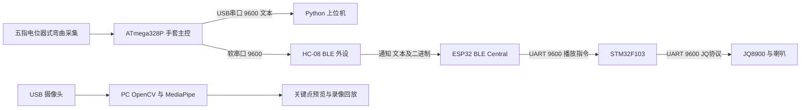

# 非遗之手硬件资料梳理与软件衔接

整理日期：2026年9月13日。目录已按本日分区方案更新；分区路径以“国创开发”工作区根目录为基准。对象：现有 pottery-studio 软件、用户提供的11个附件，以及硬件仓库 master 快照。

**核心结论：软件已有教学与练习管理底座，硬件已有五指采集、模板识别和独立语音反馈链路，摄像头另有独立演示程序。下一步主要是统一通信、状态与数据含义，把这些部分接起来。现有材料不能证明三个部分已经组成完整的陶艺教学系统。**

本文完成资料消化与接口核对，不修改业务代码，不运行附件中的上位机或摄像头程序，不烧录或操作硬件。文档和聊天里的操作步骤、取消小程序等表述均作为材料记录，不视为用户本次要求执行的指令。

## 1 阅读范围与证据边界

| 材料 | 本次处理 | 能支撑的结论 |
|---|---|---|
| 技术实现报告(1).docx | 提取并阅读全文，与固件交叉核对 | 硬件组对架构、协议与调试结果的描述；其中的稳定性结论未独立复测 |
| 使用说明(1).docx | 阅读全文 | 上电、接线、校准、模式切换的使用口径 |
| 更新内容.docx | 阅读全文 | 阶段性方案调整；与当前代码存在多处不一致 |
| pc_tool(1).rar | 解包并阅读 Python 源码 | 串口接收、快捷命令、五指绘图的具体实现 |
| GitHub master | 下载并阅读业务源码，浏览原始手套工程 | 当前公开源码的实现；不等于实物已经烧录此版本 |
| 上位机标注图片 | 阅读按钮、注释和界面 | 校准和录制操作意图，容差默认100、标注建议300–600 |
| 3张聊天截图 | 阅读全文 | 提供方说明、文件关系、演示背景及取消红外等阶段性决定 |
| 3段 MP4 | 读取元数据，每段均匀抽取12帧，检查共36帧 | 手套外观、指示灯变化、上位机界面和摄像头关键点演示 |
| pottery-studio | 阅读 README、核心逻辑、通信桥、小程序页面与配置 | 软件实际接口和硬件接入缺口 |

视频处理属于关键帧审阅，**未进行完整音轨听辨或转写**，因此本文不据视频确认每句播报、音质、精确断连延迟和完整操作时序。Word 本次审阅内容，未进行版式验收。没有重新运行网站浏览器流程、微信真机验证或硬件编译烧录。

远端快照：`8ae9975b31dee99c2eea70439d73d69d056a0d62`，提交时间 `2026-09-11T16:07:41+08:00`，提交说明 `chore: remove build artifacts from repo, update .gitignore`。[原仓库](https://github.com/zwt383/pottery-learning-glove/tree/8ae9975b31dee99c2eea70439d73d69d056a0d62)。

11个原始附件现按类别保存在 `03_项目文档/02_硬件原始文档/`、`04_素材资源/02_硬件演示视频/`、`04_素材资源/03_硬件说明与沟通截图/` 和 `05_交付归档/原始压缩包/`。来源、新路径、大小及 SHA256 保存在 `06_整理工具与核验/审阅证据/2026-09-13/attachments.json`，不再依赖微信临时目录。

## 2 当前软件底座承担什么

现有软件的主线是“观看教学 → 连接设备 → 校准与录入参考姿态 → 练习 → 反馈 → 报告与历史”。硬件上位机只覆盖其中的设备调试部分，所以已有平台具有继续使用的价值。

| 部分 | 现有实现 | 与硬件的关系 |
|---|---|---|
| desktop | React/Vite 电脑工作台，设备、曲线、校准、模板、训练、报告 | 浏览器 Web Serial / Web Bluetooth 入口 |
| mobile | React 手机浏览器交互界面 | 与电脑端共用本地服务，属于浏览器入口 |
| miniprogram | WXML/WXSS/JS 微信原生工程 | 独立本机存储，或配置工作台地址共享数据；有微信 BLE 读取桥 |
| core.mjs | 五值校验、校准端点、模板容差匹配、练习会话、报告 | 当前只理解数值样本，尚无硬件模式、心跳、识别事件、命令回执模型 |
| server.mjs | 4180端口本地 HTTP 服务 | `/api/state`、`/api/sample`、`/api/action` 等，持久化到 `data/studio.json` |

电脑与浏览器手机端通过同一个服务共享会话。小程序默认离线引擎，配置服务地址后才转为共享服务；两份存储不会自动合并。小程序目前配置为 `touristappid`，工程存在不代表已经完成微信真机验证。

现有“校准”只把当时接收的握拳、张开五路数值存在软件里；`ingest` 的匹配没有使用这些端点做归一化，也没有下发硬件校准命令。软件模板保存的是中心值、一个容差、名称及正确/错误类别，ID 使用 UUID。硬件保存的是固定0–9号槽位及五组上下限，两者不能直接互换。

现有教学区使用本地参考视频；未接入 `hand_record.py` 的实时摄像头输出。练习报告统计的是模板匹配样本占比与持续匹配次数，不能直接解释成陶艺专业评分或完整揉泥动作识别准确率。

## 3 硬件系统的实际分工



这张图描述硬件仓库现状，未把现有教学平台画成已经接通的节点。

**手套主控做识别。** `pottery_glove/` 才是当前陶艺用途的主程序，版本注释为 v2.1。五路接 A0、A1、A2、A3、A6，顺序为拇指、食指、中指、无名指、小指。ADC原始读数经映射得到500–2500，约定握拳500、张开2500。这是映射值，不是角度、压力、力矩或毫米。

源码和机械手套外观更支持“电位器式弯曲检测”的描述；《更新内容》称其为柔性弯曲传感器，具体器件仍需以实物和物料表确认。当前陶艺固件没有输出压力数据，也没有使用 MPU6050 进行姿态估计，后者仅预留了 I2C。

**ESP32 做蓝牙中继与播报调度。** 当前 `sketch_sep9a.ino` 是 BLE Client/Central，按源码里固定的手套 MAC 直连 HC-08，订阅 FFE1。没有发现供手机连接的 GATT Server、广播服务或手机命令转发实现。给 BLE 栈起名 `GloveVoice` 不等于已经提供手机可连接服务。

**STM32 做语音协议转换。** 它接收 ESP32 发来的播放、停止、音量命令，再控制 JQ8900。接线在源码和技术报告中一致：ESP TX17 → STM32 PA3，ESP RX16 ← STM32 PA2，STM32 PA9 → JQ8900 RX，共地。这里记录现有资料，不代替实物电气检查。

**摄像头由 PC 独立处理。** 《更新内容》标注型号 DF100；`hand_record.py` 使用设备序号1，并没有按型号识别摄像头。它不与手套、ESP32、STM32、现有网页或小程序交换数据。

`lehand/` 是包含 MPU6050、机械手/机械臂与旧模式的原始参考工程；`3.体感手套波特率修改程序/` 是配置用途工程。它们的模式、蓝牙角色和数据输出不能套用到当前 `pottery_glove/`。

## 4 手套从采样到反馈如何工作

### 4.1 模式0负责采集与标定

传感器约每20ms读取一次，即调度目标约50Hz；USB串口和蓝牙文本约每200ms输出一次，即约5Hz。实际周期受主循环和阻塞代码影响，这些不是实测频率。

真实数值行是：

```text
D,1787,1615,2470,2450,1500\r\n
```

其中 `D,` 是类型前缀。文件开头注释的 `D:` 不能代替实际发送函数的 `D,`。USB串口是9600，ESP32自身调试串口115200，两者必须分清。

在采集模式下，用 `CALIB_MIN` 采握拳时的ADC端点，用 `CALIB_MAX` 采张开端点，随后每路按下式映射并限制到500–2500：

```text
mapped = 500 + (raw - fistRaw) × 2000 / (openRaw - fistRaw)
```

代码支持端点方向相反。新佩戴者应重新校准；归一化只减少量程差异，尚不能保证模板跨人有效。

### 4.2 模板是单次姿态的五维区间

`RECORD <id> <tolerance>` 把当前五个数值扩成五组区间。识别条件是五根手指全部落入对应区间。

```text
对每一路 i：min[g,i] ≤ value[i] ≤ max[g,i]
```

0–4为正确模板，5–9为错误模板，最多10个槽位。不是五个连续教学步骤，也不是神经网络训练样本。重叠时固件按ID从小到大检查，返回第一个全路匹配模板；现有软件则按最大单路误差距离排序，两者可能给出不同结果。

截图建议容差300–600，默认100。这里记录为提供方经验值，不能当作最佳参数或识别准确率的证明。容差过宽会增加模板重叠。

`SAVE` 把模板和校准端点一起写入手套 EEPROM；`LOAD` 从手套 EEPROM 读回。它们不是保存/打开 PC 样本文件。上位机的波形缓存也不是平台的训练报告数据库。

### 4.3 模式1负责识别与提示

每约100ms进行一次识别：

| 结果 | USB串口 | BLE | LED |
|---|---|---|---|
| 匹配0–4 | `OK:G=<id>` | 正确事件，含ID | 全灭 |
| 匹配5–9 | `ERR:mask=<二进制数字>` | 错误事件，含ID和mask | 全亮 |
| 不匹配任何模板 | 不输出此类结果 | 不发识别事件 | 按最接近模板的不匹配手指点亮 |

**模式1不再输出连续 `D,...` 数值。** 所以上位机曲线和五指显示可能停留在上次采样。录像1多处画面中数值近似固定，不能据此证明识别模式仍持续上传采样；它与代码的模式划分相容，但未据录像确定现场固件版本。

错误模板被完整匹配时，`gesture_recognize` 返回的 mask 是0；主程序仍将所有LED点亮。由此，`ERR` 里的 mask 目前不能直接用来解释“究竟哪根手指做错”。只有不匹配模板时，mask 才反映最接近模板的区间偏差，而且该分支没有发出识别事件。

### 4.4 语音是按正确或错误类别调度

正确事件播放曲目2，错误事件播放曲目1。ESP32的5秒冷却比较的是命令类别 `cmd`，不是具体模板ID。因此从正确模板0切到正确模板1不会必然立即播报；从正确切到错误则可触发切换。

| 曲目 | 源码触发 |
|---|---|
| 1 | 错误模板匹配 |
| 2 | 正确模板匹配 |
| 3 | 手套BLE连接并订阅后，名义上“摄像头识别已开启” |
| 4 | ESP32启动、蓝牙初始化 |
| 6 | 连接状态由连接变为断开 |
| 7 | BLE连接成功后 |

仓库未包含对应 MP3/WAV 资源，本次未核验 TF 卡中的实际声音。代码中没有曲目5的上述使用路径。曲目3是连接后固定触发，**不检查摄像头或关键点识别是否正常**。

## 5 已确认的通信接口

### 5.1 文本命令

命令发送给手套，USB串口9600，结尾换行。以下是接口说明，不是本次执行过的指令。

| 命令 | 意义 | 对接注意 |
|---|---|---|
| `HELP` / `STATUS` / `LIST` | 查询帮助、状态、模板 | 回执为人类可读文本，未统一成结构化ACK |
| `MODE 0` / `MODE 1` | 设置采集/识别模式 | 使用明确参数；裸 `MODE` 在实际解析器中只返回用法 |
| `CALIB_MIN` / `CALIB_MAX` | 握拳/张开端点采集 | 应核对回执与采样变化 |
| `CALIB_RESET` | 清除运行中的校准 | 不等于已经同步清除软件记录 |
| `RECORD 0 300` | 当前姿态录入槽位0、容差300 | 固定槽位，重复录入会覆盖 |
| `THRESHOLD <id> <10个逗号分隔整数>` | 设置五路上下限 | 输入检查和写入原子性不足，见第9节 |
| `DELETE <id>` / `RESET` | 清除一个/全部模板 | 与软件删除独立，持久化还涉及SAVE |
| `SAVE` / `LOAD` | 写入/读取手套 EEPROM | 不能把串口发送成功当成保存成功 |

蓝牙文本命令也有处理路径，但部分查询的完整内容只输出到USB：例如 `LIST` 直接调用 `gesture_print_all()`，后者使用 `Serial`。不能假定所有蓝牙回执都与USB对称。HC-08模块自身的 `AT...` 配置命令另有“不带换行”规则，不能混入上述业务命令规则。

### 5.2 BLE同时包含文本和二进制

源码配置的服务 UUID 为 `0000ffe0-0000-1000-8000-00805f9b34fb`，通知特征为 `0000ffe1-0000-1000-8000-00805f9b34fb`。写特征的实物属性仍应通过服务发现确认。HC-08被配置为从机，ESP32作为Central连接它。

二进制格式：

```text
55 55 len cmd payload... xor
len = payload长度 + 2
整帧长度 = len + 3
xor = len XOR cmd XOR 每个payload字节
```

| cmd | payload | 当前发送情况 |
|---|---|---|
| `0x01` | 1字节正确模板ID | 模式1匹配正确模板时发送 |
| `0x02` | 1字节错误模板ID＋1字节mask | 模式1匹配错误模板时发送 |
| `0x03` | 1字节mode | 调用模式切换时发送 |
| `0x04` | 五个16位大端数，共10字节 | 有发送函数，但当前主循环没有调用 |
| `0x07` | 无 | 约每秒心跳，两种模式均发送 |

例：正确模板0为 `55 55 03 01 00 02`；心跳为 `55 55 02 07 05`。因此“不匹配不发任何帧”应理解为不发识别结果，心跳依然存在。

下行 `0x12/0x14/0x13/0xFF` 虽有定义，对应执行仍是 TODO，不能宣称可用。当前优先对照已实现的文本命令。

### 5.3 两种语音串口帧

ESP32 → STM32：`AA cmd hi lo checksum`，固定5字节，校验是前4字节相加取低8位；`cmd=01`播放、`02`停止、`03`音量。STM32 → JQ8900：`AA cmd len data... checksum`，播放命令为 `07`。两者不是同一种帧。

## 6 摄像头演示实现了什么

`hand_record.py` 使用 OpenCV 取图，MediaPipe处理单只手，绘制关键点和连线。按r开始录制，s暂停录制，q退出，写入固定文件 `hand_output.avi`；选择回放模式后重新对录像做识别。没有向教学平台提交关键点或训练记录。

文档称“计算弯曲角度”，实际函数为：

```python
value = clamp(int((指尖归一化y坐标 - 指根归一化y坐标) * 220), 0, 100)
```

这只是图像纵向坐标差的启发式数值，没有关节向量夹角计算，受手掌旋转、相机方向和投影影响。它与手套500–2500没有标定对应关系，不能直接相加、替换或用于相同容差匹配。

未检测到手时当前代码填五个0，缺少单独的有效性标志。后续接入应区分“没有检测到手”和“检测到某种姿态”，并记录时间戳、左右手与检测质量；目前没有双源同步、融合算法、陶艺阶段识别或标注数据集。

## 7 图片与视频如何相互印证

| 视频 | 时长 | 关键帧观察 | 尚不能证明 |
|---|---|---|---|
| `580ef634…` | 33.37秒 | 实物佩戴、手指姿态变化、LED、PC上位机；0–12秒以手背为主，15–24秒可见掌侧，27秒后回到手背 | 连续采样完整性、准确率、音频反馈内容 |
| `7e1b180e…` | 14.97秒 | PC代码与Capture窗口；约2.67秒起出现手和关键点，张开/弯曲过程中叠加骨架 | 角度精度、陶艺泥料遮挡条件、双手识别、与手套融合 |
| `22925470…` | 33.57秒 | 手套、开发板、喇叭的接线与亮灯；约18–24秒手套多盏蓝灯熄灭，27秒以后重新亮起 | 具体按键身份、断电或复位的电气过程、断连播报秒数 |

三段关键帧合图分别保存在 `06_整理工具与核验/审阅证据/2026-09-13/*-contact.jpg`，精确抽帧时刻与元数据见 `06_整理工具与核验/审阅证据/2026-09-13/videos.json`。

聊天说明补充了三个重要背景：提供方认为摄像头与传感器可能发生判断冲突；目前改用PC上位机减轻联调工作；红外已去掉，主要原因是接线与安装困难。这些是提供方的阶段性取舍，不是本次要求删除现有软件功能的指令。

上位机标注图上的中文图例存在方框字，说明其显示层仍有字体配置问题；不影响从源码识别五路顺序，但演示界面可以继续改进。截图处于未连接状态，不能据此认为当时数值已经上传。

## 8 必须分开的文档口径与代码事实

| 事项 | 材料中的说法 | 当前可核对结论 | 对后续的影响 |
|---|---|---|---|
| 微信小程序 | 更新文档与聊天称取消或去掉 | 本工作区已有原生工程；用户本次要求先了解、整理 | 作为方案分歧保留，未删除小程序 |
| ESP32型号 | 使用说明称C3；技术报告和源码注释称S3 | 代码使用UART2与GPIO16/17，按S3方案编写；实物型号未确认 | 不能直接照文档烧录或选板 |
| BLE角色 | 更新文档称ESP32从机、手机连接ESP32 | 当前ESP32代码是Central；HC-08配置为从机 | 手机连接拓扑需要重新明确 |
| 是否扫描 | 使用说明写ESP扫描手套 | 当前代码是固定MAC直连 | 更换手套需更新目标配置 |
| 断连时间 | 使用说明5秒；技术报告60秒 | 源码数据看门狗15秒，重连间隔参数5秒；协议栈回调另有影响 | 不能把5秒重试解释成5秒必定发现断连 |
| 摄像头开启 | 播报“摄像头识别已开启” | BLE连接后固定播放，没有相机就绪信号 | 界面不能把此播报视为视觉链路健康状态 |
| LED错误定位 | 使用说明称哪根手指错误哪根亮 | 错误模板匹配时全亮；未匹配时显示最接近模板的差异 | 反馈文案要遵守真实语义 |
| 连续五指BLE数据 | 协议定义了0x04 | 主循环未调用该发送函数；模式0输出文本，模式1发事件 | 只实现二进制五值解包仍收不到期望数据 |
| 同手势冷却 | 报告写同手势5秒、不同手势立即切换 | 代码按正确/错误命令类别冷却 | 不同正确模板之间未必触发新播报 |
| 样本保存 | 上位机保存/加载样本 | 按钮调用手套EEPROM命令，没有PC样本文件管理 | 模板与练习数据应分别管理 |
| 视觉角度 | 文档称弯曲角度计算 | 代码计算归一化y坐标差 | 不能报告为关节角度 |

另外，README架构图中个别箭头、HC-08“主模式”、ESP文件头的曲目映射和重试注释均存在与执行代码不一致处。本文以发送/接收函数和实际分支解释当前公开源码，仍保留实物版本可能不同这一边界。

## 9 软件对接缺口与源码风险

### 9.1 已用本地代码验证的接口不兼容

调用现有 `core.mjs` 和小程序 `utils/core.js` 的真实解析函数，使用构造的示例文本，结果如下；没有连接硬件：

| 输入或条件 | 两端当前结果 |
|---|---|
| `D,1787,1615,2470,2450,1500` | 均返回null |
| 去掉前缀的五列CSV | 均解析为五个数值 |
| `OK:G=0`、`ERR:mask=0` | 均返回null |
| 收到一次样本后，时钟推进3501ms | 共享核心显示设备未连接 |

源码还表明，桌面、手机浏览器和原生BLE桥把输入当文本，不能直接处理混有二进制心跳和事件的BLE流。现有小程序桥只导出扫描、连接、断开，没有写特征命令函数。桌面虽有通用手动发送文本命令，但校准和录制按钮尚未和它关联。

因此，不只需要修改一个前缀：必须区分连接是否活着、最近是否有采样、硬件处于什么模式、有没有识别事件。模式1没有D帧时，当前以采样新鲜度判连接的逻辑会产生错误断连显示。

### 9.2 模板和状态不能各管一套

软件校准、软件模板、硬件校准、硬件模板目前有四份状态含义。界面显示“保存成功”若只表示写入本地JSON，手套不会因此改变。建议明确硬件槽位映射、校准版本、模板版本、设备标识和命令回执，并决定谁负责最终姿态判定。

“未匹配”也要单独保留：硬件将其静音，软件当前将其显示为需要调整。它不应直接等价于已录入错误动作，否则可能出现手机提示错误而手套没有播报的冲突。

### 9.3 后续开发应关注的静态风险

下列是源码审阅发现，未进行硬件复现，本次没有修复：

1. `commands.cpp` 的 `CALIB_MAX` 回显分支直接调用 `map(raw, calib_min, calib_max,...)`，没有像 `sensors.cpp` 一样保护两端点相等；某指未移动时存在零分母风险。
2. `bluetooth.cpp` 的下行二进制接收以 `2 + len` 判断收齐，但发送器定义的完整长度是 `3 + len`，校验范围也提前截止；而对应命令执行本身仍为TODO。因此不能把下行二进制协议当成已完成接口。
3. `gesture.cpp` 只凭拇指区间是否恰好等于 `[500,2500]` 判断模板是否配置。允许拇指全范围的合法模板可能被跳过，应使用独立有效标志。
4. `THRESHOLD` 逐路直接写入且验证不足，缺少完整数量、数值范围、上下限关系校验与原子更新；文本容差也缺少严格范围检查。
5. 固件同时可能出现校准与文本输出阻塞；配置里20/100/200ms不能直接视为严格实时保证。
6. README示例选择Arduino Uno，但代码使用A6。应以实物板型和可用引脚选择构建目标；本次没有运行编译验证。

本仓库未发现电路原理图、PCB/外壳设计文件、完整物料表、语音素材、实际训练数据集或实物固件校验信息。它提供了主要软件源码，但不足以独立重建并复验整套硬件。

## 10 建议的衔接顺序

以下是消化资料后的建议，不代表本次已实施。

**第一步，将电脑工作台接入手套USB串口，完成最短的数据与配置链路。** 选择手套端9600串口，解析D帧和状态文本，关联 `MODE`、`CALIB_MIN/MAX`、`RECORD`、`SAVE/LOAD` 回执。现有教学、视频、会话、报告页面可以复用；Python上位机保留作调试参照。调试时同一串口的使用者应明确。

**第二步，解决识别模式缺少连续采样这一接口问题。** 有两个不同目标：仅保持模式0由软件匹配，能先做数据接入，但无法代表现有硬件模式1播报全链路；若要求工作台连续曲线与硬件自主识别同时工作，需要协调固件在模式1继续输出带类型的采样和明确的识别状态，或增加统一网关。未匹配事件也应显式提供，防止界面一直保留旧的“正确”。

**第三步，让小程序通过现有工作台服务共享数据与控制请求。** 这是与现有软件结构相容的起点；真正执行串口命令的设备连接端还需要命令队列与回执桥。当前 `/api/action` 只处理软件逻辑，不会把小程序操作自动发送到桌面串口。不能仅因为页面能同步就宣称硬件也能远程控制。

手机直接连接HC-08是另一条路线，但必须验证ESP32与手机能否同时连接这块实际模块。当前代码没有手机接入ESP32的服务，也没有多Central并发的证据，不能默认语音中继与手机直连可同时工作。

**第四步，单独接入摄像头的预览、录像与识别状态，再讨论融合。** 先让“相机已打开”“检测到手”“数据有效”成为真实状态；再统一时间戳、左右手、佩戴条件与坐标/量纲。后续若需要陶艺动作质量评价，要明确标准动作、分阶段标签、遮挡条件、受试者与验证数据，当前模板阈值和视频骨架不能代替这些材料。

建议后续数据契约至少区分：五指样本、模式变化、正确/错误/未匹配事件、心跳、命令回执。每条记录带时间戳和来源，关联设备、学习者、会话及校准/模板版本。硬件播报与软件播报应指定主通道，避免重复或互相矛盾。

## 11 下一轮需要补齐的信息

这些是后续联调的问题清单，本次整理不依赖现在作答。

1. 演示实物的ESP32究竟为C3还是S3，手套主板的确切型号，以及三块板实际烧录的版本是否对应此次master快照。
2. 成品使用目标是“电脑必连、手机辅助”，还是“手机脱离电脑独立运行”；是否要求保留独立硬件语音。
3. 手套USB串口连接方式、HC-08实际服务/写入属性、连接占用限制与目标MAC配置方法。
4. 10个槽位分别对应哪些陶艺动作、谁提供标准姿态，正确与错误模板的录入规范是什么。
5. 语音素材、板卡/传感器物料信息、接线图、供电说明和一段带时间戳的真实原始数据日志。
6. 摄像头角色是演示辅助、录像复盘还是评分输入；若用于评分，需要哪些精度与遮挡条件下的验证。

## 12 证据索引

硬件源码位于 `02_硬件工程/pottery-learning-glove/`；下面硬件文件路径相对此仓库。软件位于 `01_软件工程/pottery-studio/`；核对记录位于 `06_整理工具与核验/审阅证据/2026-09-13/`。以下路径与函数便于直接定位：

| 结论 | 源码位置 |
|---|---|
| 模式0的D前缀、模式1仅事件、USB9600、心跳 | `pottery_glove/pottery_glove.ino` 的 `mode_data_collection`、`mode_gesture_recognition`、`setup`、`loop` |
| 五指顺序与周期 | `pottery_glove/config.h` |
| ADC映射与端点 | `pottery_glove/sensors.cpp` |
| 模板顺序、error_mask、EEPROM | `pottery_glove/gesture.cpp` |
| 命令语法与回执 | `pottery_glove/commands.cpp` |
| BLE帧定义和长度 | `pottery_glove/protocol.h`、`protocol.cpp` |
| HC-08角色及二进制下行TODO | `pottery_glove/bluetooth.cpp` |
| UUID、15秒超时、5秒冷却和重试、相机播报 | `sketch_sep9a/sketch_sep9a.ino`，39–40、68–79、151–159、313–315行附近 |
| STM32接线及JQ帧 | `STM32F103/User/voice_app.c` |
| 上位机D解析、9600、快捷命令 | `pottery_glove/pc_tool/main.py`，43、229–236、342–348、404行附近 |
| 摄像头数据公式 | `hand_record.py`，17–31行 |
| 软件解析与3.5秒新鲜度 | 工作区 `01_软件工程/pottery-studio/core.mjs`，5–9、14行；小程序 `utils/core.js` 对应函数 |
| 桌面串口与BLE、发送命令 | 工作区 `01_软件工程/pottery-studio/desktop/src/studio.js`，10–16行 |
| 微信BLE桥及共享服务 | 工作区 `01_软件工程/pottery-studio/miniprogram/utils/bridge.js`、`pages/index/index.js` |

上位机RAR中的 `main.py` 与GitHub版本在统一换行后完全一致；原始SHA256不同是换行格式差异，见 `06_整理工具与核验/审阅证据/2026-09-13/pc-tool-comparison.txt`。Word全文提取结果保留原段落编号，位于 `06_整理工具与核验/审阅证据/2026-09-13/技术实现报告(1).txt`、`使用说明(1).txt`、`更新内容.txt`。
