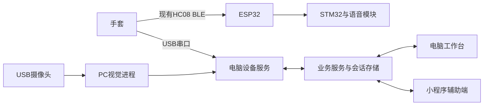

# 软件开发与整机联调计划

计划建立：2026年9月13日；进度更新：9月14日。用户已确认：负责软件开发及软硬件联通，硬件在手边，第一版采用电脑主机加小程序辅助；允许先开展开发，稍后再配合实物确认。交付日期尚未明确。

首批代码和验证结果见[设备接入开发进展](设备接入开发进展_2026-09-14.md)。A/B及C/F的一部分已进入待实物联调阶段，以下表格保留项目基线与完整目标。

最新路线调整：用户暂时没有USB数据线，已实测通过电脑BLE接入Glove手套并显示实时曲线。因此第一轮收数使用蓝牙，USB作为后续调试备选；BLE模式查询与模式往返切换也已实测；标定/模板写入以及与语音板并行仍待验证。

## 你的任务和第一版目标

项目计划书把平台开发组的任务写为线上教学平台、线下教学终端开发、系统联调与运维；硬件通信组负责硬件接口、蓝牙方案和通信测试，算法组负责模型与识别效果。你的直接交付物应是一套可操作、可观察、可记录、可复盘的软件系统，硬件固件协议变更需要与硬件组一起完成。

第一版收敛到一位学习者、一只手套、一台电脑、一种已定义的陶艺练习。完整过程是：启动 → 选择手套 → 确认实时数据 → 校准 → 录制并保存标准/错误姿态 → 开始练习 → 实际反馈 → 结束保存 → 小程序查看同一份报告 → 重启后仍能查看。

计划书中的95%识别率、1度精度、8小时运行等是项目目标，目前没有对应验收数据。五路弯曲映射值也不能提供压力、每个关节角度或完整揉泥质量评分。第一版先使用可解释的模板匹配，并明确正确、错误、未匹配、无数据四种状态。

## 当前工程判断

| 部分 | 现状 | 接下来 |
|---|---|---|
| 电脑与手机浏览器界面 | 已有教学、练习、校准、模板、报告页面 | 保留并接入真实设备服务 |
| 微信原生小程序 | 工程和共享服务调用存在，未做真机验收 | 先作为电脑主机的操作/查看端 |
| 手套固件 | 有采样、校准、10个模板槽位和自主识别 | 核对实物版本，处理模式1不输出连续采样的问题 |
| 硬件语音 | 有手套BLE到ESP32到STM32/JQ的代码与演示资料 | 和平台统一判定来源，实测播报与重连 |
| 摄像头 | PC独立关键点及录制程序 | 接入预览/有效状态/会话录像，再考虑融合 |
| 数据保存 | 保存配置和报告摘要；完整采样主要在内存 | 增加会话原始数据日志及可追溯信息 |

## 我来开发时采用的架构

这是一份目标架构，不表示所有连线已经实现。

将串口连接、拆包、设备状态、命令串行执行和回执放到电脑本地Node服务。浏览器刷新不应断开采集，小程序通过同一业务服务发起操作。Node SerialPort提供串口读写和流式处理，可用于这一实现；当前Windows环境已成功加载并枚举串口，枚举结果为空；实物收发仍待验证。[官方用法](https://serialport.io/docs/guide-usage/)

第一轮用手套USB串口接电脑，保留已有BLE语音通道。手机同时直连HC08是否可行尚未证明，当前ESP32也没有供手机连接的服务。小程序网络接入要在真实AppID和手机上验证；局域网开发调试不等于已具备发布条件。

## 开发顺序和验收点

| 阶段 | 交付 | 验收方式 |
|---|---|---|
| A 设备协议与接收 | 9600串口、D帧、模式/识别文本、UTF8分包、设备状态与日志 | 构造拆包/坏包测试；随后实物逐指确认数值；浏览器刷新后采集仍在 |
| B 硬件控制 | 模式、校准、模板槽位、EEPROM保存/加载及回执 | 未确认时不显示成功；拒绝无效校准；重新上电后检查设备实际模板 |
| C 练习和数据 | 一次练习关联设备、校准、模板版本、采样、事件和报告 | 原始日志能追溯报告；无数据不计成绩；暂停不累计；重启保留记录 |
| D 硬件语音与连续曲线 | 识别结果与平台显示一致，连接存活与采样新鲜度分开 | 正确/错误/未匹配切换、断连恢复；模式1无采样时不伪造曲线 |
| E 摄像头 | 真实预览、关键点有效性、录像及会话关联 | 相机拔出/遮挡/未检测到手时有正确状态；可以回放本次练习 |
| F 小程序与整机验收 | 共享状态、训练控制、校准请求、同一报告 | 真机操作电脑连接的设备；端间无重复控制；记录验收环境与结果 |

A和B是首批开发重点。C之后才形成可复盘的教学链路；D需要确认硬件固件，E需要摄像头实物，F需要微信环境。时间安排按这些可验收里程碑推进，尚不承诺未确认的日期。

## 必须协调的固件事项

1. 确认ESP32为C3还是S3、手套板型和实际烧录版本，保存现有可运行版本后再考虑刷写。
2. 当前mode1停止D帧，只输出识别结果。若要求硬件自主语音和持续曲线同时运行，需为mode1增加持续采样或网关数据转发，不能只改网页解析器。
3. 为未匹配状态提供显式事件，避免平台继续显示上一次正确结果；USB错误事件最好包含模板ID。
4. 修复校准端点相同导致的零分母风险，校准和模板命令提供明确结果。现有下行二进制命令仍为TODO，首批沿用已实现文本命令。
5. 命令已写入串口、设备已执行、已写入EEPROM是三个不同状态，界面和日志分开显示。没有关联ID的旧协议只能做有限回执匹配，超时后禁止盲目重发写操作，需查询设备恢复同步。

## 数据和识别规则

平台保留设备原始采样及来源。硬件模板使用0–9槽位，软件模板有名称和业务ID，必须建立映射，不能默认两个“保存”按钮写同一份数据。跨佩戴者和重新校准后提示重新检查模板。

第一轮沿用硬件自主识别时，硬件结果作为实时提示的主来源，软件匹配可作为独立分析结果标明，避免两个判定同时给出矛盾建议。无新结果和未匹配应明确显示；不得用最后一次正确状态一直累计成绩。

相机的0–100数值目前来自图像纵向坐标差，尚非关节角度。先提供录像复盘与关键点显示，不直接与五指500–2500相加。后续专业评价需要教学方提供标准动作、步骤定义和带标签数据。

## 首次实物配合时需要做什么

用户方便时，确认电脑已插入手套USB线并识别COM口，提供板卡型号和上电顺序。随后逐指运动核对通道、握拳张开校准、录入少量清晰模板，再测一次完整练习。摄像头可稍后接入。

建议把“10分钟完整练习、5次断连恢复、一次设备重新上电、一次软件重启、一次小程序结束练习并查看报告”作为首轮演示回归清单。这些是建议的初验项目，不等于计划书的长期稳定性或算法精度指标。

没有实物接入时可完成代码、协议夹具、异常流程和日志测试；这些测试必须标注为离线测试，不能报告成硬件已经联通。
