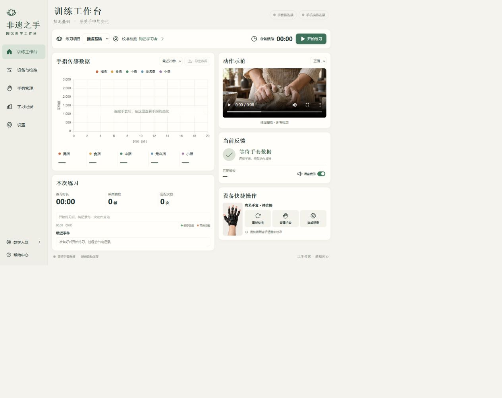
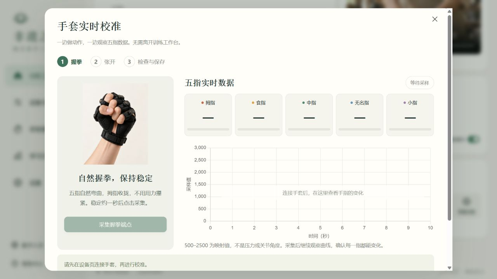
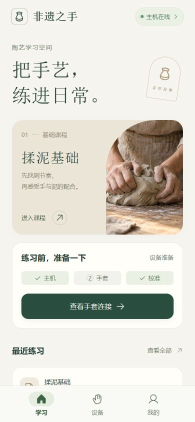
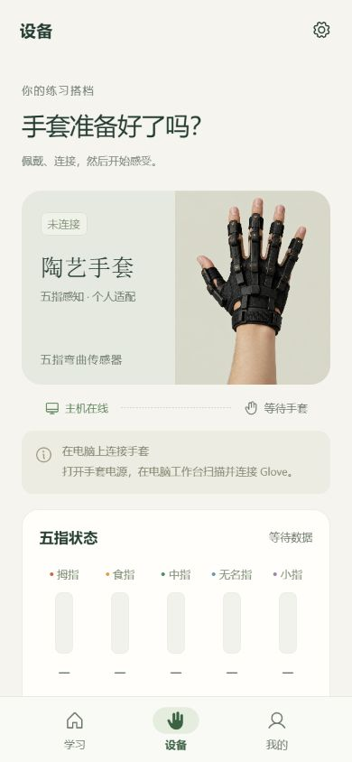
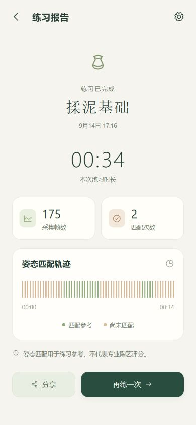

# 非遗之手

### 让手中的变化被看见，让每一次陶艺练习留下记录。

揉、压、收、放——学习陶艺，许多细节发生在手指之间。非遗之手把教学示范、手套感知和练习记录放在一起，让学习者在动手的同时看到自己的变化，也让教师有更具体的内容可以讲解和回顾。

这是一套围绕陶艺学习打造的软件：**电脑上的教学工作台，搭配手机里的学习助手。** 从一次示范开始，到一份练习记录结束，让课堂上的体验能够被接着讨论、继续练习。

*电脑工作台：示范视频、五指曲线、练习记录与设备操作，集中在同一个学习空间。*

## 看示范，也看见自己的动作

在电脑工作台，一边观看揉泥参考视频，一边观察五根手指的实时变化。曲线、数值和当前反馈集中呈现，让“刚才手指怎么动的”有了可以一起看的依据。

校准也在练习页面完成。跟随握拳、张开的图示操作，旁边就是实时数据，不必在不同页面之间来回寻找。

*动作图示与五指读数并排呈现，跟着步骤完成个人校准。*

## 留下参考，找到自己的节奏

教师和学习者可以录入参考姿态，再通过重复练习观察自己与参考的接近程度。熟悉一个姿态、放慢一次动作、重新尝试——软件为这样的练习提供及时的参照。

当前版本比较的是五指参考姿态，帮助观察和讨论动作；完整陶艺技法仍需要教师指导与真实操作体会。

## 电脑专注课堂，手机陪伴练习

电脑承担连接手套、展示数据与保存记录的工作，安卓 App 把示范、练习控制和报告带到更顺手的位置。两端连接同一台主机，共享一场练习的进度。

<table>
<tr><th>从一堂课开始</th><th>准备好你的手套</th><th>回看每一次练习</th></tr>
<tr>
<td></td>
<td></td>
<td></td>
</tr>
</table>

*以上手机界面由 App 0.2.0 的浏览器运行页面按手机尺寸截图，展示首页、设备和已有练习报告。电脑与设备截图拍摄时手套未连接，保留实际状态；报告为已有记录。*

| 电脑 Web 工作台 | 安卓学习助手 |
|---|---|
| 示范视频与五指实时曲线同屏呈现 | 在手机上查看示范与设备状态 |
| 图示引导校准、录入参考手势 | 开始、暂停、继续和结束共享练习 |
| 观察反馈，回顾完整练习记录 | 查看报告、添加结束备注、分享摘要 |
| 导出数据与报告，便于教学整理 | 离线回看最近同步的报告 |

## 练过之后，有迹可循

练了多久、采集了多少数据、哪些时候接近参考——结束练习后，一份报告把过程留下来。学习者可以回顾自己的尝试，教师也可以结合记录讨论下一次练习的重点。

我们希望记录成为交流的起点：帮助理解变化，而不是用一个分数替代对手艺的判断。

## 为谁而做

- **陶艺初学者**：跟随示范动手，用可见的反馈认识自己的手指动作。
- **教学人员**：把难以描述的手部细节变成可以共同观察的课堂内容。
- **非遗教学与体验团队**：围绕真实练习组织示范、体验和回顾。

项目目前处于体验与联调阶段，已提供电脑工作台与安卓体验版本，正在围绕实际课堂完善参考匹配和交互反馈。

## 开始体验

[电脑 Web 使用说明书](03_项目文档/04_使用说明/电脑Web使用说明书.md) · [安卓 App 使用说明书](03_项目文档/04_使用说明/安卓APP使用说明书.md)

想了解资料和工程的位置，请看[项目目录导航](项目目录导航.md)与[文档索引](03_项目文档/文档索引.md)。安装、连接、技术配置和常见问题均收录在说明书中。

---

**以手传艺，感知匠心。**

硬件基础来自 [pottery-learning-glove](https://github.com/zwt383/pottery-learning-glove)，本仓库围绕教学工作台、手机辅助与学习记录持续开发。页面截图来自实际运行的软件。
